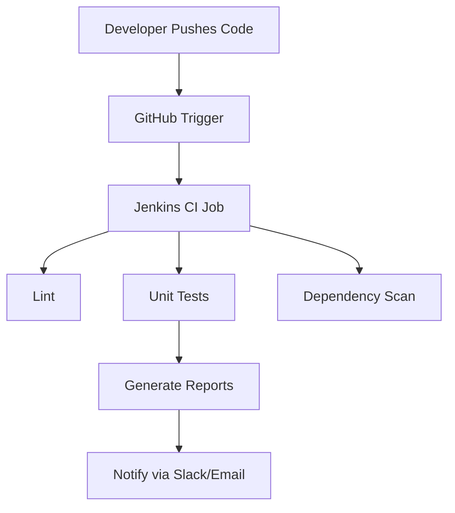

# **Dependency Scanning for Python CI Checks**
| Created        | Last updated      | Version         | author|  Internal Reviewer | L0 | L1 | L2|
|----------------|----------------|-----------------|-----------------|-----|------|----|----|
| 2025-05-16  | 2025-05-16   |     Version 1         |  Mohamed Tharik |Priyanshu|Khushi|Mukul Joshi |Piyush Upadhyay|

## Table of Contents
1. [Introduction](#introduction)  
2. [What is Python CI & Dependency Scanning?](#what-is-python-ci--dependency-scanning)  
3. [Why is it Important?](#why-is-it-important)  
4. [Dependency Scanning Workflow in CI](#dependency-scanning-workflow-in-ci)  
5. [Different Tools used for Dependency Scanning](#different-tools-used-for-dependency-scanning)  
6. [Tools Comparison](#tools-comparison)  
7. [Advantages of Using Dependency Scanning](#advantages-of-using-dependency-scanning)  
8. [Best Practices](#best-practices)  
9. [Recommendation](#recommendation)  
10. [Conclusion](#conclusion)  
11. [Contact Information](#contact-information)  
12. [References](#references)

## Introduction
In modern software development, Continuous Integration (CI) is a critical practice that helps detect issues early, improve code quality, and speed up release cycles. For Python-based microservices such as the Attendance API and Notification-Worker in the OT-MICROSERVICES ecosystem, integrating CI with dependency scanning ensures secure, maintainable, and high-quality code.

## What is Python CI & Dependency Scanning?
- **Python CI**: Automates testing, linting, coverage analysis, and packaging of Python applications after every code change.
- **Dependency Scanning**: Identifies known vulnerabilities in project dependencies (libraries/packages) by analyzing requirements.txt, Pipfile.lock, etc.

## Why is it Important?
- Prevent security vulnerabilities from being deployed
- Ensure consistent build and deployment quality
- Maintain code standards
- Reduce technical debt early in the development lifecycle

## Dependency Scanning Workflow in CI

## Different Tools used for Dependency Scanning
| **Tool**                   | **What It Does**                                                                                                                                       |
| -------------------------- | ------------------------------------------------------------------------------------------------------------------------------------------------------ |
| **Snyk**                   | Cloud tool that checks your Python packages for known security issues. Works well with GitHub, Jenkins, and even your code editor (IDE).               |
| **Safety CLI**             | Simple command-line tool that quickly checks your `requirements.txt` for vulnerabilities. Fast and great for local use.                                |
| **pip-audit**              | Official tool from Python’s core team. Scans your project for known issues using a trusted database. Very accurate and easy to use.                    |
| **OWASP Dependency-Check** | Scans projects in many languages (not just Python) using the official NVD database. Powerful, but a bit harder to set up and use for Python-only apps. |
| **GitHub Dependabot**      | Built into GitHub. It automatically finds and fixes unsafe packages in your project by creating pull requests. No setup required!                      |
| **Poetry Audit Plugin**    | Adds security scanning to projects using `poetry`. Best if you manage dependencies in `pyproject.toml`.                                                |

## Tools Comparison 
| Feature / Tool          | **Snyk**                | **Safety CLI**   | **pip-audit**        | **OWASP Dependency-Check**            | **GitHub Dependabot** | **Poetry Audit Plugin** |
| ----------------------- | ----------------------- | ---------------- | -------------------- | ------------------------------------- | --------------------- | ----------------------- |
| **Language Support**    | Multi-language          | Python only      | Python only          | Multi-language                        | Python + others       | Python (Poetry only)    |
| **Database Source**     | Proprietary + Public    | PyUp             | OSV (Open Source)    | CVE/NVD                               | GitHub Advisory DB    | PyPI Advisory DB        |
| **CI Integration**      | Jenkins, GitHub, GitLab | CLI only         | CLI only             | Jenkins plugin, CLI                   | GitHub-native         | Manual                  |
| **GitHub Integration**  | Yes                     | Manual           | Manual               | Manual                                | Built-in              | No                      |
| **Auto-Fix PRs**        | Yes                     | No               | No                   | No                                    | Yes                   | No                      |
| **Transitive Scanning** | Yes                     | No               | Partial              | Yes                                   | Yes                   | No                      |
| **IDE Support**         | VS Code, IntelliJ       | No               | No                   | No                                    | GitHub only           | No                      |
| **Free Tier**           | Yes (Limited)           | Yes              | Yes                  | Yes                                   | Yes                   | Yes                     |
| **Best For**            | Secure CI/CD            | Quick local scan | Fast official audits | Enterprises with multi-language needs | GitHub-hosted repos   | Teams using Poetry      |

## Advantages of Using Dependency Scanning
| Advantage          | Explanation                                                   |
|--------------------|---------------------------------------------------------------|
| **Automated Workflow** | Developers get instant feedback after every commit or PR      |
| **Improved Security**  | Detects vulnerabilities early before reaching production      |
| **Developer Efficiency** | Quick scans help catch issues early, saving time and reducing debugging efforts |
| **Scalability**        | Easy to apply the same scanning setup to other microservices  |

## Best Practices
| Best Practice                            | Description                                         |
|----------------------------------------|-----------------------------------------------------|
| Pin all Python dependencies             | Specify exact versions to avoid unexpected issues  |
| Integrate CI on every commit and PR    | Ensure code is tested and scanned continuously      |
| Include dependency scans in every build | Catch vulnerabilities early in the development cycle |
| Fail builds on high-severity vulnerabilities | Prevent deployment if critical issues are found   |
| Maintain separate test and production requirements files | Manage dependencies specific to testing and production environments |

## Recommendation
Among the dependency scanning tools compared, **Snyk** emerges as the most suitable choice for the **OT-MICROSERVICES Attendance API and Notification-Worker** due to:
- Broader ecosystem support
- Native integration with GitHub and Jenkins
- Advanced vulnerability insights

## Conclusion
I recommend **Snyk** because it provides **scalable**, **secure**, and **developer-friendly** dependency scanning with seamless **CI/CD integration**, making it ideal for **enterprise-grade microservices** like these. Its **comprehensive database** and **automation capabilities** surpass other tools, ensuring **early detection** and **mitigation** of security risks.

## Contact Information
| Name | Email address         |
|------|------------------------|
| Mohamed Tharik  | md.tharik.sanaatak@mygurukulam.co    |

## References

| Link                                                                                                         | Description                                                       |
|--------------------------------------------------------------------------------------------------------------|-------------------------------------------------------------------|
| [Snyk Documentation](https://docs.snyk.io/)              | Official docs for Snyk, used for vulnerability scanning in dependencies. |
| [Safety CLI Tool](https://pyup.io/safety/)               | Lightweight Python CLI for scanning dependencies via PyUp database.       |
| [OT-MICROSERVICES GitHub](https://github.com/OT-MICROSERVICES) | GitHub organization containing the Attendance and Notification API code.  |
