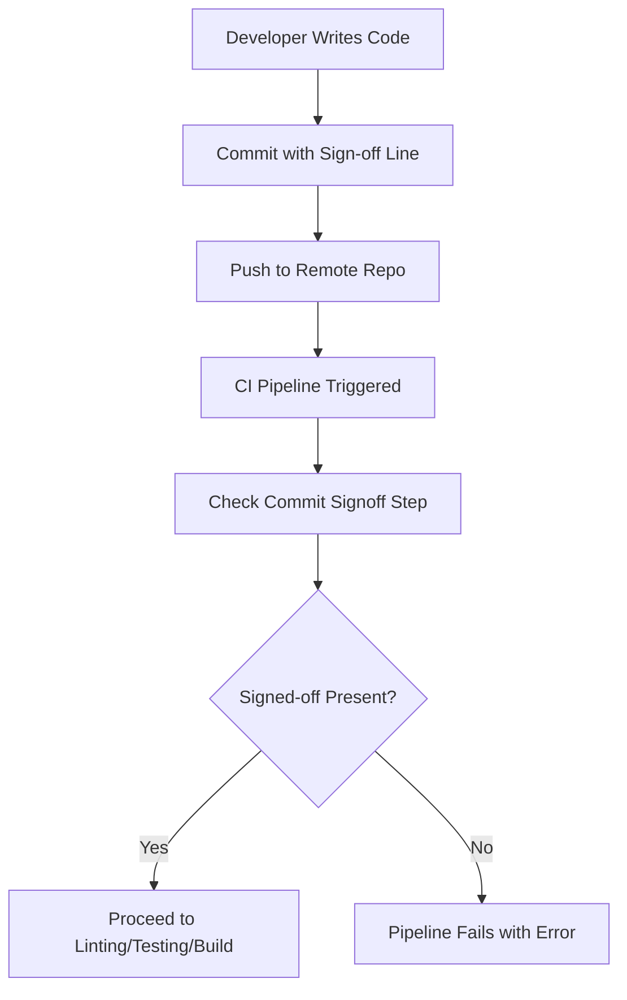

<p align="center">

</p>

# **Commit Sign off in Generic CI operation**

| Created        | Last updated      | Version         | author|  Internal Reviewer | L0 | L1 | L2|
|----------------|----------------|-----------------|-----------------|-----|------|----|----|
| 2025-05-15  | 2025-05-15   |     Version 1         |  Mohamed Tharik |Priyanshu|Khushi|Mukul Joshi |Piyush Upadhyay|

## Table of Contents

## Introduction 
In modern CI/CD workflows, it's important to ensure that every code change is traceable and legally compliant. Commit Signoff is a lightweight method that adds accountability by requiring contributors to certify their changes with a simple signoff line in the commit message.

## What is Commit Signoff?
A Commit Signoff is a line added at the end of a Git commit message that certifies the contributor wrote the code or otherwise has the right to submit it under the project's license. The line looks like:
```text
Signed-off-by: John Doe <john.doe@example.com>
```
This practice is widely adopted in open source projects like the Linux kernel and ensures traceability and legal compliance.

## Why is Commit Signoff Important?
- **Accountability**: Tracks who is responsible for a change.
- **Compliance**: Ensures contributors agree to project licensing terms.
- **Auditability**: Supports code audit and governance processes.
- **Trust**: Helps prevent unauthorized or malicious contributions.
- **Security**: Combined with GPG signing, it protects from identity spoofing.

## Proof of Concept (POC) of Commit Signoff with Generic CI Operation
Ensure that every commit to the repository contains a valid Signed-off-by line before proceeding with any CI steps like linting, testing, or build.

### Step 1: Git Commit Command with Signoff
Developer commits changes using:
```bash
git commit -s -m "Add feature X"
```
This automatically adds:
```pgsql
Signed-off-by: Your Name <your.email@example.com>
```
### Step 2: CI Workflow File (GitHub Actions Example)
```bash
# .github/workflows/ci.yml
name: CI Pipeline with Commit Signoff Check

on:
  push:
    branches: [main]
  pull_request:
    branches: [main]

jobs:
  validate-commit-signoff:
    name: Check Commit Signoff
    runs-on: ubuntu-latest
    steps:
      - name: Checkout Code
        uses: actions/checkout@v3

      - name: Check for Signed-off-by in Last Commit
        run: |
          SIGNED_OFF=$(git log -1 --pretty=%B | grep -i "Signed-off-by")
          if [ -z "$SIGNED_OFF" ]; then
            echo "❌ Commit is missing 'Signed-off-by' line."
            exit 1
          else
            echo "✅ Commit is signed off."
          fi

  build-and-test:
    name: Lint, Test, and Build
    runs-on: ubuntu-latest
    needs: validate-commit-signoff
    steps:
      - name: Checkout Code
        uses: actions/checkout@v3

      - name: Run Linting
        run: echo "🔍 Linting..."

      - name: Run Tests
        run: echo "🧪 Running tests..."

      - name: Build Application
        run: echo "📦 Building..."
```

## Commit Signoff Workflow in CI

## Advantages
| Benefit                | Description                                     |
| ---------------------- | ----------------------------------------------- |
|Legal Certainty     | Ensures contributor agrees to license.          |
|Clear Attribution   | Traceability of each code contribution.         |
|Better Audits       | Easier code history analysis and filtering.     |
|Enforceable via CI  | Prevents merges without proper signoffs.        |
|Contributor Clarity | Reminds devs of responsibility in code changes. |

## Conclusion
Commit Signoff is a simple yet powerful tool in CI pipelines to ensure code traceability, legal compliance, and security. It integrates smoothly into modern DevOps practices and fosters responsible collaboration in teams and open-source projects alike.

## Contact Information
| Name | Email address         |
|------|------------------------|
| Mohamed Tharik  | md.tharik.sanaatak@mygurukulam.co    |

## Reference

| Link                                                                                                         | Description                                                       |
|--------------------------------------------------------------------------------------------------------------|-------------------------------------------------------------------|
| [Git Docs - Signoff Option](https://git-scm.com/docs/git-commit#Documentation/git-commit.txt--s) | Official Git documentation on using the `--signoff` flag.         |
| [GitHub Actions Docs](https://docs.github.com/en/actions)                                        | Guide for creating and managing GitHub Actions workflows.         |
| [Pre-commit Hook Example](https://githooks.com/)                                                 | Examples of Git hooks, including enforcing commit signoffs.       |

