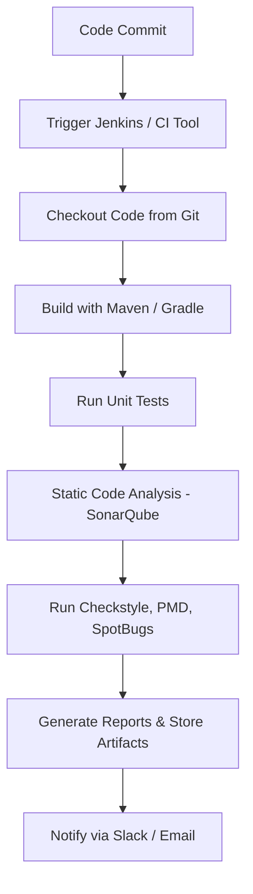

  
  

# **Java Application CI Design with Bug Analysis Documentation**

| Created        | Last updated      | Version         | author|  Internal Reviewer | L0 | L1 | L2|
|----------------|----------------|-----------------|-----------------|-----|------|----|----|
| 2025-05-15  | 2025-05-15   |     Version 1         |  Mohamed Tharik |Priyanshu|Khushi|Mukul Joshi |Piyush Upadhyay|

## Table of Contents 

1. [Introduction](#introduction)  
2. [What is Bug Analysis in Java CI?](#what-is-bug-analysis-in-java-ci)  
3. [Why Java CI with Bug Analysis?](#why-java-ci-with-bug-analysis)  
4. [CI Workflow Diagram for Bug Analysis](#ci-workflow-diagram-for-bug-analysis)  
5. [Tools for Java Bug Analysis](#tools-for-java-bug-analysis)  
6. [Tool Comparison for Bug Analysis](#tool-comparison-for-bug-analaysis)  
7. [Advantages of Integrating Bug Analysis in CI](#advantages-of-integrating-bug-analysis-in-ci)  
8. [Best Practices](#best-practices)  
9. [Recommendation](#recommendation)  
10. [Conclusion](#conclusion)  
11. [Contact Information](#contact-information)  
12. [Reference](#reference)  

## Introduction 
In the modern software development lifecycle, Continuous Integration (CI) plays a pivotal role in ensuring code quality, faster release cycles, and early detection of issues. For Java-based applications, integrating CI with bug analysis tools is essential for delivering robust and scalable software solutions.

## What is Bug Analysis in Java CI?
Bug Analysis in Java CI is the automated detection of code issues—like bugs, code smells, and security vulnerabilities—during the continuous integration process. Tools like SonarQube or SpotBugs scan the code after every commit to ensure quality, stability, and security. This helps developers catch and fix problems early, before code reaches production.

## Why Java CI with Bug Analysis?
- Early detection of integration bugs
- Automated testing and code quality validation
- Prevention of regression issues
- Enforcing coding standards via static analysis
- Seamless collaboration among distributed teams

##  CI Workflow Diagram for Bug Analysis

## Tools for Java Bug Analysis
| **Tool**        | **Purpose**                                                             |
| --------------- | ----------------------------------------------------------------------- |
| **SonarQube**   | Comprehensive static code analysis (bugs, smells, vulnerabilities)      |
| **FindBugs/SpotBugs**    | Detects runtime bugs and potential defects in Java bytecode             |
| **PMD**         | Scans Java source code for programming flaws and bad practices          |
| **Checkstyle**  | Verifies code style and enforces coding standards                       |
| **FindSecBugs** | Security plugin for SpotBugs to detect vulnerabilities                  |
| **Infer**       | Facebook’s static analyzer for detecting null dereferences, leaks, etc. |
| **Coverity**    | Commercial tool for deep static analysis and bug detection              |
| **CodeQL**      | Semantic code analysis using queries (popular for security auditing)    |

## Tool Comparison for Bug Analaysis
| **Tool**        | **What It Does**                                                        | **Bug Detection**                                   | **CI/CD Support**                               | **Reports & UI**                             | **Languages**                         | **Cost**            |
| --------------- | ----------------------------------------------------------------------- | --------------------------------------------------- | ----------------------------------------------- | -------------------------------------------- | ------------------------------------- | ------------------- |
| **SonarQube**   | Checks code for bugs, bad practices, and security issues.               | ✅ Finds most types of bugs and vulnerabilities.     | ✅ Works well with Jenkins, GitHub, GitLab, etc. | ✅ Clean dashboard with graphs & details.     | Java, Python, JavaScript, etc.        | Free / Paid Version |
| **SpotBugs**    | Scans compiled Java code to find potential runtime errors.              | ✅ Finds real Java bugs (e.g., null pointers).       | ✅ Supports Maven, Gradle, Jenkins.              | ⚠️ Basic reports, no fancy UI.               | Java only                             | Free (Open Source)  |
| **PMD**         | Checks source code for poor coding practices and bad design.            | ⚠️ Limited bug detection, mainly code style issues. | ✅ CLI and Jenkins plugin available.             | ⚠️ Moderate reports (HTML/XML).              | Java, Apex, XML, etc.                 | Free                |
| **Checkstyle**  | Ensures code follows Java style and formatting rules.                   | ❌ Doesn’t find bugs, just style issues.             | ✅ Easy with Maven, Gradle, Jenkins.             | ⚠️ Very basic output, mainly for developers. | Java only                             | Free                |
| **FindSecBugs** | Adds security checks to SpotBugs (e.g., SQL injection, XSS).            | ✅ Detects common Java security bugs.                | ✅ Works with Maven and Jenkins.                 | ⚠️ Uses SpotBugs-style reports.              | Java (for security scans)             | Free                |
| **Infer**       | Created by Meta, finds memory, thread, and null-related bugs.           | ✅ Advanced bug detection (nulls, concurrency).      | ⚠️ Mostly CLI-based; supports GitHub Actions.   | ❌ Minimal UI or dashboard.                   | Java, C, C++, Objective-C             | Free                |
| **Coverity**    | Deep analysis for large codebases, used in enterprise environments.     | ✅ Very accurate and powerful at finding bugs.       | ✅ Works with all major CI/CD tools.             | ✅ Rich dashboards and collaboration tools.   | Java, C, C++, C#, JS, etc.            | Paid (Commercial)   |
| **CodeQL**      | Turns code into a database, allows querying it to find security issues. | ✅ Strong at finding logic bugs and vulnerabilities. | ✅ Best with GitHub Actions, CLI also works.     | ✅ GitHub security tab + CLI reports.         | Java, Python, C/C++, JavaScript, etc. | Free / GitHub Paid  |

## Advantages of Integrating Bug Analysis in CI
- Reduced time to identify and fix bugs
- Enforces development standards
- Enhances team collaboration and accountability
- Continuous visibility into code health
- Prevents critical bugs from reaching production

##  Best Practices
- Use pull request validations to run CI
- Enforce coverage thresholds
- Use SonarQube Quality Gates
- Keep pipeline fast and modular
- Integrate with Slack/MS Teams for notifications
- Maintain a common Jenkinsfile template

## Recommendation
Among the tools compared, **SonarQube** emerges as the **most comprehensive choice** for bug analysis in Java CI due to:
Deep integration with Jenkins, GitHub, GitLab
- Customizable quality gates
- Rich visualization of bugs, code smells, vulnerabilities
- Support for multi-language projects (scalability)

## Conclusion
I recommend **SonarQube** because it provides **superior bug detection**, **customizable rulesets**, and **tight CI/CD integration**, making it more effective and scalable than tools like PMD or Checkstyle when used alone.

## Contact Information
| Name | Email address         |
|------|------------------------|
| Mohamed Tharik  | md.tharik.sanaatak@mygurukulam.co    |

## Reference

| Link                                                                                                         | Description                                                       |
|--------------------------------------------------------------------------------------------------------------|-------------------------------------------------------------------|
| [Jenkins – Official Site](https://www.jenkins.io/)                                                                                                                  | Official Jenkins documentation for setting up CI/CD automation pipelines.                                       |
| [SonarQube – Static Code Analysis Tool](https://www.sonarqube.org/)                                                                                                 | SonarQube documentation for integrating static code analysis into CI pipelines.                                 |
| [Checkstyle – Code Style Checker](https://checkstyle.sourceforge.io/)                                                                                               | Tool for ensuring Java code follows standard naming and formatting conventions.                                 |
| [PMD – Source Code Analyzer](https://pmd.github.io/)                                                                                                                | Finds common programming issues like empty try/catch blocks, unused variables, etc.                             |
| [FindBugs – Bug Detection Tool](https://findbugs.sourceforge.net/)                                                                                                  | Static analysis tool to detect bugs in Java bytecode (now replaced by SpotBugs).                                |
| [Tutorials of CI/CD Pipeline with Static Code Analysis](https://www.tutorials24x7.com/java/creating-a-cicd-pipeline-with-static-code-analysis-for-java-projects) | Step-by-step tutorial for building a Java CI/CD pipeline with static analysis tools like SonarQube and Jenkins. |
